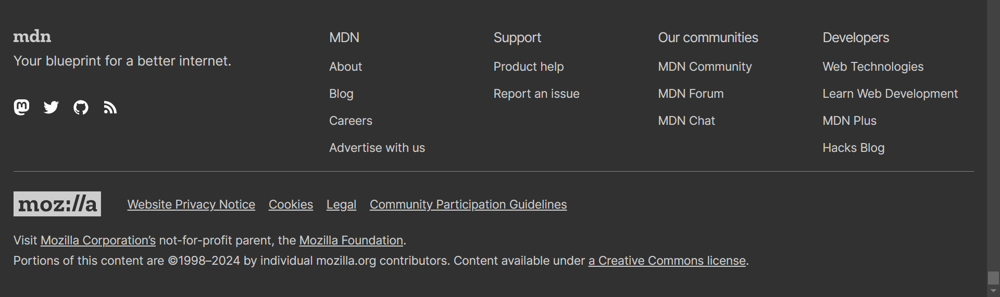
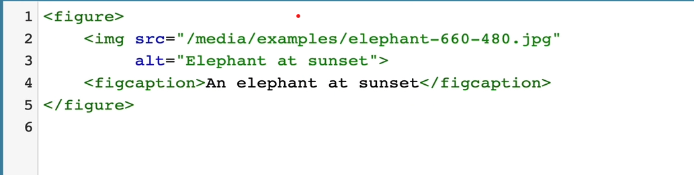

# Semantic elements
#### That can be used instead of using plain divs

- \<section>
- \<article>
- \<nav>
- \<main>
- \<header>
- \<footer>
- \<aside>
- \

- \

## Let's see these elements one by one

1. ### \<main>
   - This element should contain dominant or most important content of the page
   - It should exclude any content which is repeated across the page like navigation links, side bars, logo, copyright info etc.
   - This element tells the browser that this content which is present inside main tags is the most important or the only content present on the webpage.

2. ### \<nav>
   - This element is used to provide navigation links present in the webpage.
   - Navigation links include links present in navigation bars or also the sidebars.

3. ### \<section>
   - Section is the element which is supposed to be used for only writing content in it
   - No buttons, No design elements, Nothing other than plain old text.
   - Usually it contains some sort of header ( H2 to H7 ) and paragraph containing information regarding tht header.

4. ### \<article>
   - Article element is used to represent stand-alone, self-contained composition in a webpage or a document.
   - Article element can contain information that is independant of any website content i.e. it should not depend upon contents of the website.
   - It usually is used for including forum post, magzine or newspaper articles, or blog entry, or a product cards, weather widgets, any other interactive widgets etc.
5. ### \<aside>
   - Aside element is used for including content in the webpage that is indirectly related to the content of the webpage.
   - Aside element can be used for including meta information that user can read about the webpage.
   - It can also be used for side-notes describing a paragraph included in the webpage
6. ### \<footer>
   - Footer element, as name suggests, is used for including footer in the webpage.
   - Footer usually includes company logo, social links of the company like facebook, meta, twitter etc. also external links to other company websites etc. along with legal info like terms an conditions, privacy policy etc.
   - 
    - eg. 
7. ### \<header>
   - Header is used for including links to other linked webpages and navigation bars.
8. ### \<time>
   - Time element is an inline element
   - It is used to represent time in a machine readable format so that web crawlers or web reading softwares can interpret time.
   - It contains a mandatory tag datetime with machine readable value 
9.  ### \<figure>
    - This element is used for semantic purposes i.e for machine readability. 
    - It is used for enclosing images in the tag.
    - e.g 
    - Code: 
  
    - \<figcaption> element is used to set a caption for the image.
10. \<data> 
    - [\<data> mdn reference](https://developer.mozilla.org/en-US/docs/Web/HTML/Element/data)

Note: These semantic elements are used for machine readability and are not for, visual user's satisfaction.